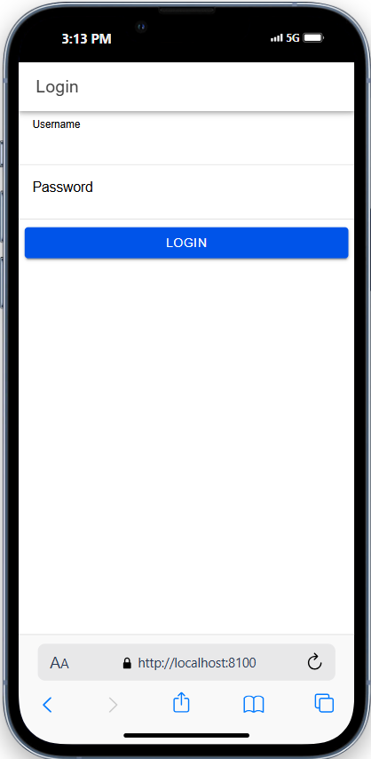
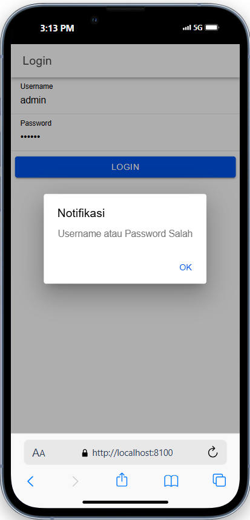
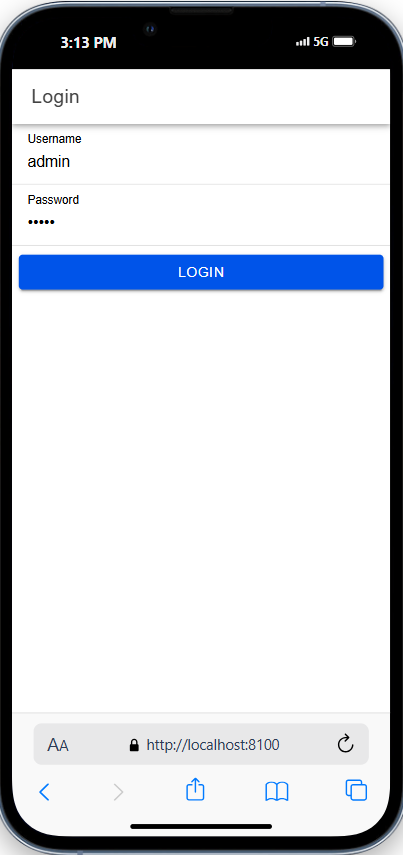
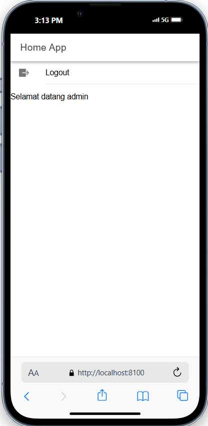

# Fitur Login pada Ionic

Tugas pertemuan 7 praktikum pemrograman mobile membuat fitur login dengan menggunakan ionic.

## Cara kerja login dan logout

### 1. Database

- Di backend, database menyimpan data pengguna seperti `username` dan `password`.
- Saat pengguna mencoba login, aplikasi Ionic mengirimkan data ini ke server untuk diverifikasi. Jika cocok dengan data di database, server akan mengembalikan `token` sebagai tanda bahwa login berhasil.

### 2. Backend (PHP)

- PHP menangani permintaan login dari aplikasi Ionic melalui endpoint (`login.php`).
- Setelah menerima `username` dan `password`, PHP memvalidasi data terhadap database. Jika valid, PHP mengembalikan respons berisi `status_login` dengan nilai "berhasil" dan `token` untuk autentikasi selanjutnya.
- Jika tidak valid, PHP mengirimkan respons `status_login` "gagal" untuk memberi tahu aplikasi Ionic.

### 3. Frontend (Ionic)

- Pengguna memasukkan `username` dan `password` pada halaman login.
- Ketika tombol login ditekan, aplikasi memanggil metode `postMethod` pada `AuthenticationService` yang mengirim data login ke server (PHP).
- Jika login berhasil (dengan `status_login` "berhasil"), `token` disimpan dalam aplikasi menggunakan `Capacitor - Preferences`, dan pengguna diarahkan ke halaman `home`.
- Jika login gagal, aplikasi menampilkan pesan kesalahan menggunakan `AlertController`.

### 4. Guards (Auth Guard dan Auto-Login Guard)

- `AuthGuard` memastikan hanya pengguna yang sudah login yang bisa mengakses halaman `home`.
- `AutoLoginGuard` mengarahkan pengguna yang sudah login langsung ke `home` tanpa harus login ulang setiap kali membuka aplikasi.

### 5. Logout

- Pada halaman `home`, pengguna bisa memilih logout, yang akan menghapus `token` dan `user` dari penyimpanan (`Preferences`) dan mengembalikan mereka ke halaman login.

## Screenshots

  
  
  
  

